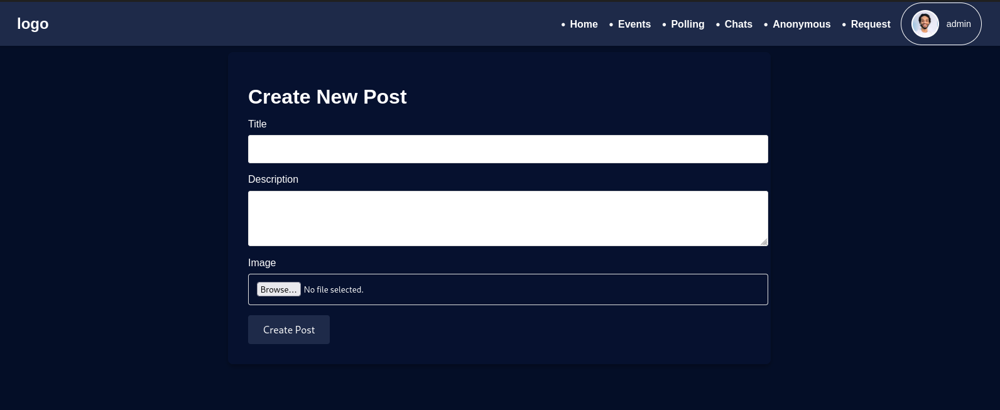
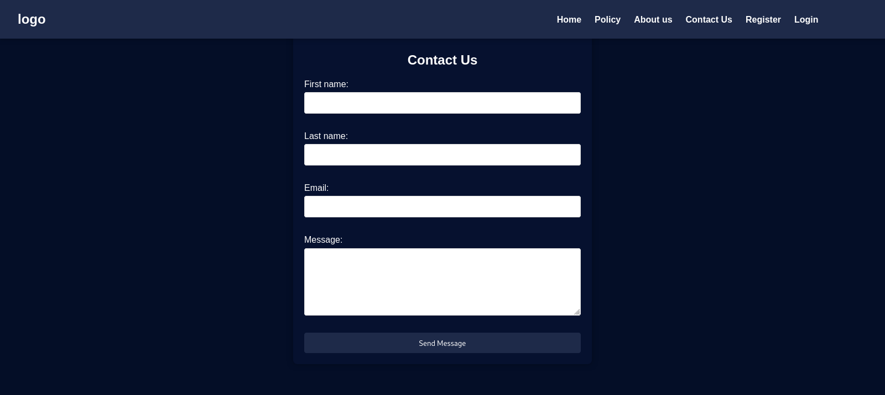
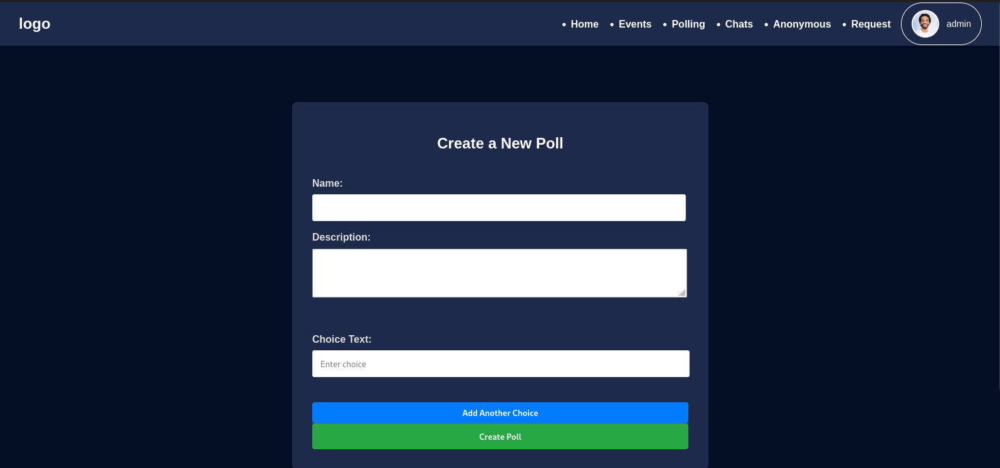
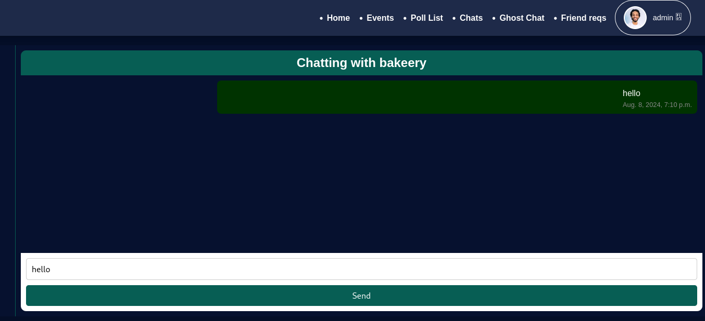

# ANYC (All Nigerian Youth Congress) Web Application

## Project Overview

**ANYL (All Nigerian Youth Congress)** is a transformative platform designed to engage and empower Nigerian youth in the reformation of the country's political system. This web application serves as a hub for organizing activities, facilitating communication, and managing various aspects of the organization. By leveraging technology, ANYL aims to drive positive change, promote effective leadership, and address critical issues such as unity, security, and economic growth.

## Objectives

1. **Foster Unity**: Promote national cohesion and bridge the divides caused by tribalism, religion, and regional differences.
2. **Cultivate Leadership**: Support and develop ethical and capable leaders who can guide Nigeria towards progress.
3. **Enhance Security**: Mobilize communities to create safer environments and address security challenges.
4. **Promote Economic Growth**: Advocate for economic diversification and sustainable development.

## Components

### 1. **User Profiles**
   - **Profile**: Manages user information, including personal details, bio, and profile picture.
   - **User Types**: Different roles (admin, staff, members) with specific permissions and functionalities.

### 2. **Communication Tools**
   - **ChatMessage**: Facilitates direct messaging between users.
   - **Anonymous chat**: This facilitate whistleblowers to share information with people anonymously.
   - **LiveChatSession**: Enables real-time group chats.
   - **GroupMessage**: Allows messaging within groups.

### 3. **Events & Polls**
   - **Event**: Manages events with details like location, time, and attendees.
   - **Poll**: Creates and manages polls for feedback and decision-making.
   - **Question & Choice**: Components of polls for capturing user responses.

### 4. **Feedback Mechanism**
   - **Feedback**: Collects user feedback on polls and posts.

### 5. **Posts & Media**
   - **Post**: Handles user-generated posts, including likes and dislikes.
   - **Image & Media Fields**: Supports image, video, and audio uploads for various components.

### 6. **Groups & Memberships**
   - **Group**: Manages group creation, description, and membership.
   - **GroupMembership**: Tracks user memberships in groups.
   - **GroupJoinRequest**: Handles requests to join groups.

### 7. **Administrative Functions**
   - **StaffApplication**: Manages staff applications and their approval status.
   - **ContactMessage**: Collects contact messages from users.

## Getting Started

1. **Clone the Repository**: 
   ```git clone https://github.com/your-repo/ynl-webapp.git```

2. **Install Dependencies**:
```pip install -r requirements.txt```

3. **Apply Migrations**
```python3 manage.py migrate```

4. **Run the Development Server**:
```python manage.py runserver```

## Contributing
We welcome contributions from the community! If you are interested in contributing to YNL, please follow these steps:

1. Fork the Repository.
2. Create a Feature Branch:
  ```git checkout -b feature/your-feature```

3. Make Changes and Commit:
```git commit -am 'Add new feature```

4. Push to the Branch
```git push origin feature/your-feature```

## Contribution Guidelines
- Ensure code adheres to the project's style guide.
- Test new features thoroughly before submitting a pull request.
- Provide a clear description of the changes in your pull request.

## Warning
⚠️ If you are not planning to contribute to this project, please avoid cloning or forking the repository

# Contact
For any inquiries or further information, please contact us at [bakeery.wtf@gmail.com]         

## Screenshots

Below are some screenshots of the ANYL web application:

- **Home Page**
  
  
- **About Us Page**
  
  
- **Login Page**
  
  
- **Registration Page**
  
  
- **User Profile**
  
  
- **Create Post**
  
  
- **Create Event**
  
  
- **Polls**
  

- **polling**
  
  
- **Update Profile**
  
  
- **Contact Us**
  
  
- **Policy**
  
  
- **Create Poll**
  
  
- **Events**
  
  
- **Anonymous Chat**
  
  
- **Normal Chat**
  
  
- **Post**
  
  
- **Apply for App Features**
  


#Note: for more features of the app kindly clone the repository
